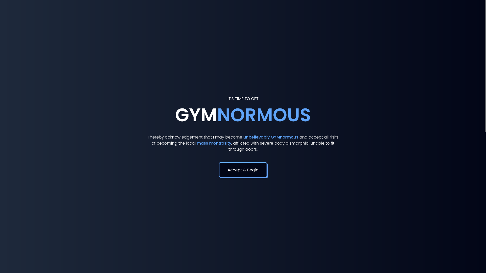
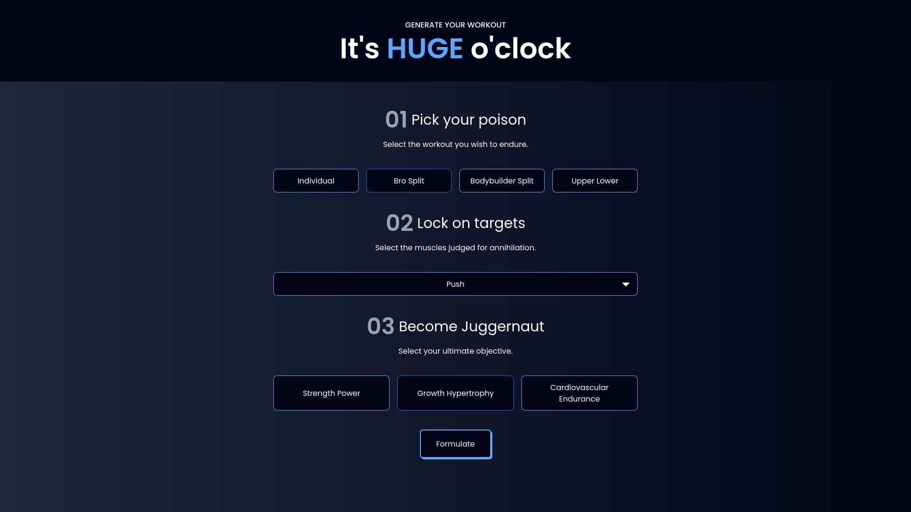
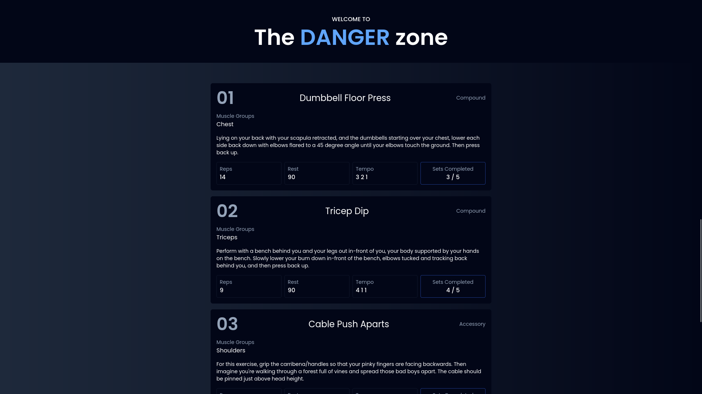

# GYMnormous

## About

GYMnormous is a React-based app that lets you create your own workout routines. It was created to practice and improve my coding skills in React.js and Tailwind CSS.

## Live Version

Available at: https://kaklewski.github.io/gymnormous/

## Features

-   **Dynamic Workouts**: The workout set is customized based on the objective selected, with tailored sets, reps, and rest times.
-   **Automated Workout Generation**: Based on user selections (workout type, muscle group and objective), the app generates a workout set with specific exercises, sets, and reps.
-   **Randomization Feature**: Provide slightly different exercises for variety when the same options are selected multiple times.
-   **Responsive Design**: The app is designed to be fully responsive, providing a seamless experience on both desktop and mobile devices.

## Screenshots

## Run Locally

1. Clone the project to your local machine:

`git clone https://github.com/kaklewski/gymnormous`

2. Navigate to the project directory:

`cd gymnormous`

3. Install the dependencies:

`npm install`

4. Start the development server:

`npm run dev`

## Build with Vite

1. Build the dist:

`npm run build`

2. Preview the build:

`npm run preview`
